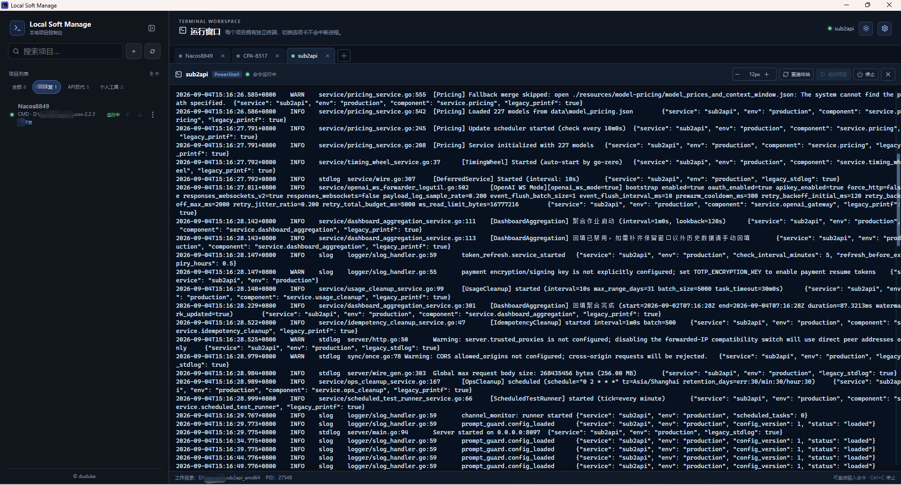
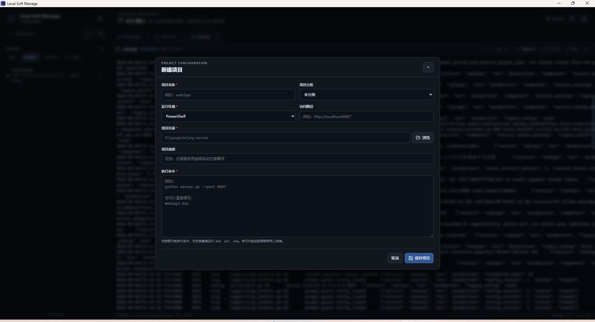
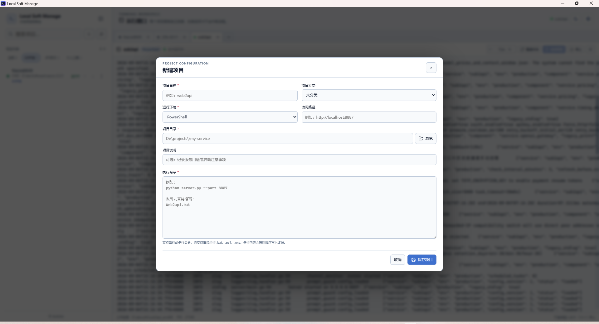

# Local Soft Manage

Local Soft Manage 是一个 Windows 优先的本地项目启动与终端管理工具。
它把常用项目的启动命令集中到一个窗口中，每个项目拥有独立的 CMD 或
PowerShell 终端，可以在多个项目之间切换而不影响正在运行的进程。

## 功能概览

- **项目配置**：保存项目名称、分类、运行环境、访问路径、项目目录、说明和执行命令。
- **独立终端**：每个项目对应一个独立 PTY，支持 CMD、PowerShell、输入命令和查看输出。
- **多项目选项卡**：切换选项卡只切换视图，不会关闭其他项目的终端或进程。
- **启动与停止**：从项目菜单启动、停止项目，也可以只打开 CMD 或 PowerShell。
- **快捷排序**：项目列表中三点菜单左侧的上/下箭头可以直接调整项目顺序。
- **搜索与分类**：搜索项目名称、目录、命令和说明；分类较多时使用两侧箭头浏览分类标签。
- **分类数据字典**：右侧顶部设置按钮可以添加、删除和调整项目分类顺序，项目表单使用下拉选择。
- **浏览器访问**：配置 `http://` 或 `https://` 地址后，可以从项目菜单调用系统默认浏览器打开。
- **主题和终端字号**：支持白天/黑夜模式；每个终端可单独调整 10–24px 字号。
- **可折叠侧栏**：收起左侧栏后可以为右侧运行窗口留出更多空间。

## 界面展示

Local Soft Manage 的主要页面如下。左侧项目列表负责项目筛选和快捷操作，右侧运行窗口负责终端会话、选项卡切换及命令交互。

### 主工作区



主工作区包含项目搜索、分类筛选、项目排序和三点菜单；右侧使用独立终端选项卡管理多个项目。切换选项卡只切换当前视图，不会中断其他项目的终端进程。

### 新建项目（黑夜模式）



新建项目时，先填写项目名称和分类，再选择运行环境、填写访问路径，最后补充项目目录、说明及执行命令。带星号的字段为必填项。

### 新建项目（白天模式）



项目配置表单支持白天和黑夜两种主题；主题可以通过右上角的模式切换按钮随时切换。

## 快速开始

### 运行环境

- Windows 10/11。
- Node.js、pnpm。
- Rust 工具链（开发和构建 Tauri 桌面应用时需要）。
- WebView2 Runtime（Tauri Windows 应用运行所需，Windows 10/11 通常已预装）。
- 被管理项目自身所需的运行时，例如 Python、Node.js、Java 或其他程序。

### 安装和启动开发环境

```powershell
pnpm install
pnpm tauri dev
```

只启动前端页面进行界面开发时，可以使用：

```powershell
pnpm dev
```

## 基本使用流程

1. 点击左侧搜索框右侧的 `+` 按钮。
2. 填写项目名称、项目目录和执行命令；按需选择运行环境、分类并填写访问路径。
3. 点击“保存项目”。项目会出现在左侧列表，并打开对应的终端选项卡。
4. 点击项目行右侧的上/下箭头调整顺序，点击三点菜单执行其他操作。
5. 选择“启动项目”执行保存的命令；也可以选择“打开 CMD”或“打开 PowerShell”。
6. 在右侧终端中直接输入命令并按 Enter 执行，使用 Ctrl+C 中断当前命令。
7. 工作完成后点击“停止项目”。修改配置后再次启动即可使用新配置。

左上角的侧栏按钮可以收起或展开项目列表。右侧终端选项卡过多时，选项卡两侧的左右箭头可以平滑滚动；分类标签过多时也使用同样的左右箭头浏览。

## 项目字段说明

| 字段 | 必填 | 说明 |
| --- | --- | --- |
| 项目名称 | 是 | 左侧项目列表和终端选项卡中显示的名称，不能与其他项目重复。 |
| 项目分类 | 否 | 从设置维护的数据字典中选择；没有分类时选择“未分类”。 |
| 运行环境 | 是 | 选择 PowerShell 或 CMD，决定项目终端使用的 Shell。 |
| 访问路径 | 否 | 只接受 `http://` 或 `https://` 地址，用于“浏览器访问”。 |
| 项目目录 | 是 | 终端的工作目录，支持手动填写或点击“浏览”。 |
| 项目说明 | 否 | 记录用途、端口或启动注意事项。 |
| 执行命令 | 是 | 支持单行、多行命令，也支持直接运行 `.bat`、`.cmd`、`.ps1` 和 `.exe`。 |

项目目录由用户自行管理。Local Soft Manage 不会修改或删除项目目录中的文件；删除项目只会删除应用中的项目配置。

## 分类数据字典

右侧运行窗口顶部，主题切换按钮旁边是设置按钮。打开设置后，可以：

- 添加分类名称；
- 删除分类名称；
- 使用上移/下移按钮调整分类顺序；
- 保存后同步更新项目表单下拉框和左侧分类筛选。

项目分类不预置默认值。删除某个分类后，该分类不会再出现在筛选标签、项目列表徽标或项目分类下拉框中；编辑使用了已删除分类的项目时，会按“未分类”处理。

## 启动 `.bat` 文件

假设批处理文件位于 `D:\web2api\web2api.bat`：

1. 项目目录填写 `D:\web2api`。
2. 如果使用 CMD，运行环境选择 **CMD**，执行命令填写：

   ```bat
   web2api.bat
   ```

3. 如果使用 PowerShell，执行命令填写：

   ```powershell
   .\web2api.bat
   ```

4. 保存项目后，从项目三点菜单点击“启动项目”。

如果脚本依赖 Python、Node.js、Conda 或其他程序，请确认这些程序已经安装，并且可以在所选 Shell 的 PATH 中找到。批处理脚本内部的工作目录切换、环境变量和参数应按脚本自身语法配置。

## 终端操作

- **启动项目**：执行项目配置中的命令；已存在同项目终端时会复用该终端。
- **停止**：向当前项目命令发送 Ctrl+C，Shell 会话仍然保留，便于继续输入命令。
- **重建终端**：关闭当前终端并创建一个新的同类型终端，适合 Shell 状态异常或需要清空屏幕时使用。
- **打开 CMD / PowerShell**：为当前项目切换并重建指定 Shell。
- **关闭选项卡**：关闭该项目的终端会话；再次点击项目时会创建新的终端。
- **终端字号**：使用终端工具栏中的 `−`、字号和 `+` 调整当前项目终端字号。

终端支持复制、粘贴、方向键和直接输入。窗口大小变化时会自动同步 PTY 的行列数。前台服务持续运行时，后续命令需要等服务退出后才会执行，这是 Shell 的正常行为。

## 数据存储位置

项目配置使用 SQLite 保存，数据库文件名为 `soft-manage-v2.sqlite3`。Windows 默认位置为：

```text
%APPDATA%\com.ddk.softmanage\soft-manage-v2.sqlite3
```

展开 `%APPDATA%` 后通常类似于：

```text
C:\Users\<用户名>\AppData\Roaming\com.ddk.softmanage\soft-manage-v2.sqlite3
```

应用首次启动时会自动创建目录和数据库。备份或迁移数据库前请先退出 Local Soft Manage，避免应用运行期间读写文件产生不一致。

项目分类字典（`project_categories` 表）与项目配置一起保存到上述 SQLite 数据库；主题偏好仍由 WebView2 的本地存储保存。旧版本 localStorage 中的分类不会自动迁移，请在“设置”中重新维护一次。

## 常见问题

### 保存项目失败

确认项目名称、项目目录和执行命令均已填写；项目名称不能重复。项目目录必须存在，并且应用进程对该目录具有访问权限。

### 启动后立即退出或没有输出

在终端中检查工作目录、命令文件和依赖程序是否存在。`.bat`/`.cmd` 通常选择 CMD，`.ps1` 通常选择 PowerShell。需要重新初始化 Shell 时点击“重建终端”。

### 停止后批处理窗口仍在等待

部分 Windows 批处理脚本在收到 Ctrl+C 后会显示“是否终止批处理操作 (Y/N)”。终端会尝试自动回复 `Y`；如果脚本使用了自定义提示，可以直接在终端输入确认字符。

### 端口被占用

先在对应终端按 Ctrl+C 或点击“停止”，再检查其他程序是否占用了相同端口。必要时可以在项目说明或执行命令中记录端口信息。

## 开发命令

```powershell
# 类型检查
pnpm typecheck

# 前端测试
pnpm test

# 前端生产构建
pnpm build

# Tauri 开发模式
pnpm tauri dev

# Rust 检查、测试和格式检查
cargo check --manifest-path src-tauri/Cargo.toml --no-default-features
cargo test --manifest-path src-tauri/Cargo.toml --no-default-features
cargo fmt --manifest-path src-tauri/Cargo.toml -- --check
```

生产桌面安装包可以使用：

```powershell
pnpm tauri build
```

## 项目结构

```text
src/
├── app/                 React 应用入口和项目列表
├── features/projects/   项目表单、分类标签
├── features/settings/  应用设置和分类字典
├── features/terminal/  xterm.js 终端和选项卡工作区
├── platform/            Tauri API、数据契约和校验
└── styles/              全局、表单和弹窗样式

src-tauri/src/
├── commands.rs          Tauri 命令
├── repository.rs        SQLite 项目仓库
├── pty.rs               PTY 终端管理
└── lib.rs               应用初始化和事件转发
```

## 安全边界

Local Soft Manage 只执行用户在项目配置中填写的命令。应用不会扫描磁盘、远程同步项目或自动修改项目源代码；项目目录、脚本内容以及脚本启动的子进程由用户自行负责。

## 许可与第三方依赖

本项目自身的源代码和未另行标注的项目内容采用 MIT License，详见根目录
[`LICENSE`](LICENSE)。该许可不改变第三方依赖及其附带内容各自适用的许可
和版权声明。

主要第三方依赖及许可如下：

- `@tauri-apps/api`、`@tauri-apps/plugin-dialog`、Tauri Rust 框架及插件：
  MIT 或 Apache-2.0；
- `react`、`react-dom`、`@xterm/xterm`、`@xterm/addon-fit`、`vite`、
  `vitest` 及多数前端开发工具：MIT；
- `lucide-react`：ISC；其中部分图标沿用 Feather 项目的 MIT 许可；
- `typescript`：Apache-2.0；
- `rusqlite`：MIT；`serde`：MIT 或 Apache-2.0；
- 构建工具间接使用的 `caniuse-lite` 数据：CC BY 4.0，归属说明为
  `caniuse.com`。

发布包含第三方依赖的源码包、安装包或其他再分发物时，请保留相应的版权、
许可和归属声明。完整依赖版本以 `package.json`、`pnpm-lock.yaml`、
`src-tauri/Cargo.toml` 和 `src-tauri/Cargo.lock` 为准。

Windows、PowerShell、WebView2、React、Tauri、xterm.js 等名称和商标归其
各自权利人所有；本项目不暗示与相关权利人存在官方关联或背书关系。项目截图、
图标及其他非依赖资源应在再分发前确认其版权和隐私权来源。
